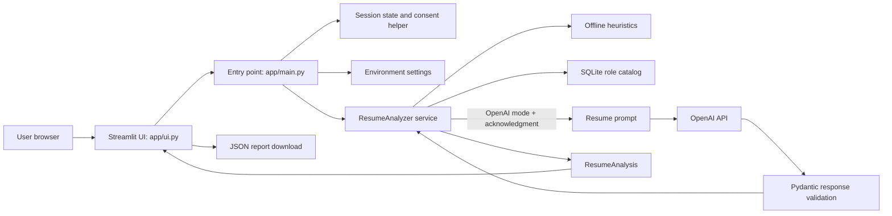

# Architecture

## High-Level Architecture

The application is a Streamlit monolith with a presentation layer, environment-backed configuration, an analysis service, and a small SQLite catalog of static role profiles. Analysis is performed either by local deterministic heuristics or by the optional OpenAI chat-completions API. Resume text is not written to SQLite.



## Components

| Component                        | Responsibility                                                                                                                                                                     |
| -------------------------------- | ---------------------------------------------------------------------------------------------------------------------------------------------------------------------------------- |
| `app/main.py`                    | Loads settings, constructs the catalog and analyzer instances, selects the active mode, gates submission, and passes results to the UI.                                            |
| `app/ui.py`                      | Renders the sidebar, resume editor, OpenAI notice/consent checkbox, analysis dashboard, clear action, and report download.                                                         |
| `app/config/settings.py`         | Loads `.env` and process environment variables. Validates `MAX_RESUME_CHARACTERS` as an integer of at least 500.                                                                   |
| `app/services/resume_service.py` | Validates resume length, detects known skills, generates Offline narrative, invokes OpenAI when configured, validates provider output, matches roles, and builds `ResumeAnalysis`. |
| `app/prompts/resume_prompt.py`   | Defines the system prompt and wraps submitted resume text as untrusted input.                                                                                                      |
| `app/services/job_catalog.py`    | Creates/seeds the role-profile table and reads ordered profile records. Supports a persistent in-memory catalog connection for tests.                                              |
| `app/utils/analysis_state.py`    | Invalidates stale analysis, enforces explicit OpenAI consent before invoking the analyzer, and clears session data.                                                                |
| `app/utils/logging_config.py`    | Configures standard application logging without resume content.                                                                                                                    |
| `tests/`                         | Contains service/config/catalog tests and Streamlit AppTest flows.                                                                                                                 |

## Data Flow

1. `Settings.from_environment()` reads `OPENAI_API_KEY`, `OPENAI_MODEL`, `DATABASE_PATH`, `MAX_RESUME_CHARACTERS`, and `LOG_LEVEL`.
2. The UI initializes the editor with the demo resume if there is no current session value. Text changes clear existing analysis and OpenAI consent.
3. Offline mode is the default. OpenAI mode is offered only if a key is configured; its checkbox acknowledgment is required for each changed resume/mode state.
4. `analyze_and_replace()` clears prior analysis/report state and checks consent before calling the analyzer.
5. `ResumeAnalyzer.analyze()` trims and validates the text, extracts known technical and soft skills, then takes the selected analyzer path.
6. Offline mode creates summary and experience text using local rules. OpenAI mode sends resume text to the configured provider, requests a strict JSON schema, and validates the response with `OpenAIResumeResponse`.
7. Job matches are computed from technical skills detected locally, not from model-proposed technical skills. The service scores equal-weight skill overlap against catalog profiles, filters scores below 30%, and returns up to three roles.
8. The UI renders the `ResumeAnalysis` fields and creates a JSON download from `analysis.to_dict()`. The report is not stored separately.
9. Clear empties the resume in session state, removes analysis/report/consent state, and selects Offline mode.

## Folder Structure

```text
app/
  config/       Environment-backed settings
  prompts/      OpenAI system and user prompt construction
  services/     Resume analysis and SQLite role catalog
  utils/        Logging and session/consent state helpers
  main.py       Streamlit entry point and orchestration
  ui.py         Streamlit presentation layer
tests/          Pytest service, catalog, settings, and AppTest coverage
docs/           Workshop product and engineering artifacts
.github/
  workflows/ci.yml  GitHub Actions tests and compilation
```

## AI Layer

OpenAI mode is available only when `OPENAI_API_KEY` is non-empty. The user must select OpenAI-powered analysis and acknowledge the transfer before the service is called. The OpenAI client uses `OPENAI_MODEL` (default `gpt-4o-mini`), a 30-second timeout, one retry, and a strict JSON-schema response format. `OpenAIResumeResponse` requires string/list fields and rejects additional properties. Provider/validation exceptions are logged by type only and converted to a generic `ResumeAnalysisError`.

The technical skills used for role matching are always detected locally from the supported skills vocabulary. The model can still supply narrative fields and soft skills; schema validation confirms their shape, not their factual accuracy.

## SQLite Role Catalog

`JobCatalog` seeds five built-in role profiles: Backend Developer, Data Analyst, Cloud Engineer, Full-Stack Developer, and QA Automation Engineer. Each row stores a title, comma-separated skill string, and description. `all_profiles()` reads them ordered by title. `INSERT OR IGNORE` seeds missing titles; there is no administrative role editor or migration framework. Resume text and analysis history are not stored in the catalog.

## Security Boundaries

- The OpenAI key is read from environment/`.env`; `.env` is excluded by `.gitignore`.
- The application sends the full submitted resume text to OpenAI only in selected OpenAI mode after explicit acknowledgment.
- Resume text is held in Streamlit session state until cleared or the session ends; it is not written to SQLite or logs.
- Provider output is shape-validated, but generated narrative remains untrusted guidance.
- The app has no built-in authentication, authorization, per-user rate limit, or usage quota. Public deployment therefore needs additional controls.
